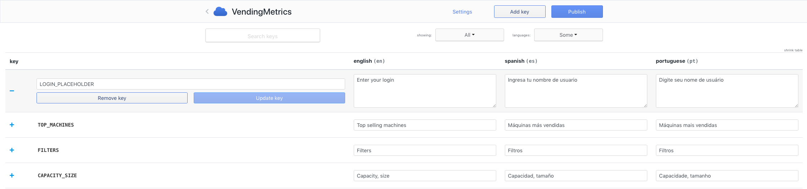

Every from my last 5 projects had requirement to support multiple languages. But I cannot find any solution which will be supporting
many systems, be non-technical users friendly and give me ability to easy manage all keys and translations. That
is why I created [SimpleLocalize](https://simplelocalize.io?ref=blog.jpomykala.me).


The idea is simple, we use [react-intl](https://github.com/yahoo/react-intl) as usually, because I didn't want to change already used
framework. Now we gather all keys from the source code and push them to the system using CLI tool

```bash{}
$ npm save -g simplelocalize-cli

```

and run

```bash{}
$ simplelocalize-cli /project-source-directory
```


In ReactJS project need to add SimpleLocalize dependency

```bash{}
$ npm install --save simplelocalize
```

and add wrapper to the root of our application (probably same place where we use redux `<Provider/>`)


```js{}
import React from "react";
import SimpleLocalize from "simplelocalize";
//...

class App extends React.Component<any, any> {

  render () {
    return (
          <SimpleLocalize locale='en'>
            <Application/>
          </SimpleLocalize>}
    );
  }
}

export default App;
```

No we can start translating key or event invite somebody to the project to help us.




